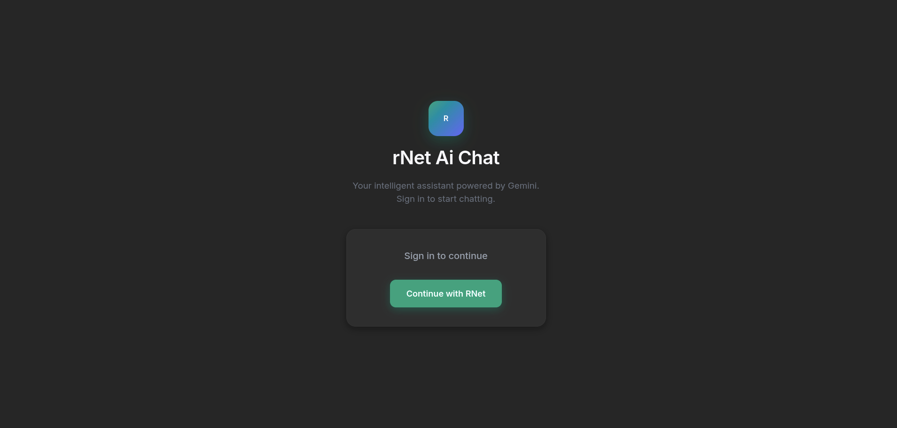
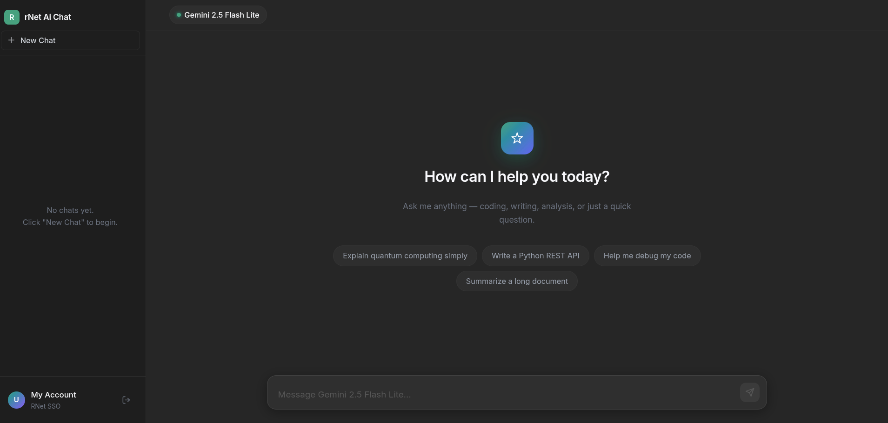
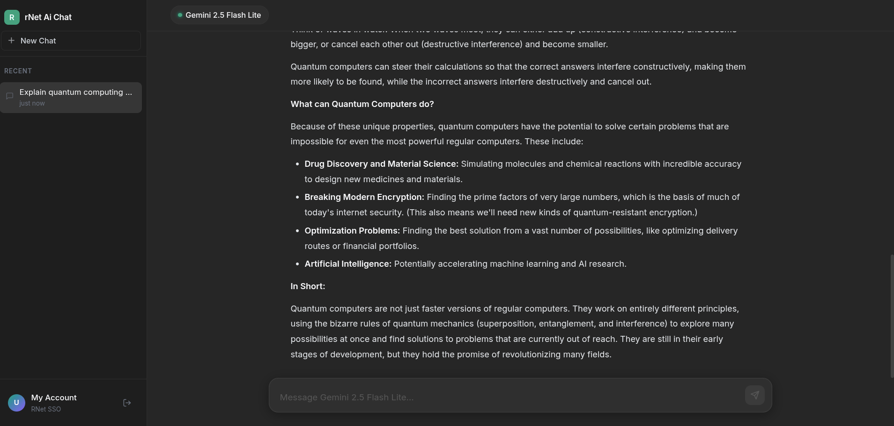

# Demo: AI Chat + RNet OAuth

This is a full-stack chat application demo, similar to ChatGPT, that showcases the **RNet ecosystem**.

AI usage is paid from the user's rNet credit balance, so developer can build pro.

## Benefits of RNet OAuth
- **Zero Friction:** Users log in once and share AI tokens across Web, CLI, and IDEs. No manual API key pasting.
- **Shared Credits:** The same rNet wallet balance can be used across connected apps.
- **Zero Token Cost:** Developers can build products without paying model API costs.

## Application Features
- **Chat Interface**: Send prompts and receive AI responses in a clean chat layout.
- **Chat History**: View and continue recent conversations.
- **Model Usage**: Demonstrates calls to developer-selected AI models.
- **Extensible Architecture**: RAG and other advanced features can be added easily.

## Set Up

### Prerequisites

- Node.js and npm
- An rNet developer account
- An rNet application registered for this chat app

### Register the rNet Application

1. Log in at the [RNet Dashboard](https://www.rnetai.org/dashboard).
2. Create a new developer application.
3. Set the redirect URI exactly to:

   ```text
   http://localhost:3001/callback
   ```

   The redirect URI must match the value in `backend/server.js`, including protocol, host, port, and path. `http://localhost` is intended for local development only; production redirect URIs should use HTTPS.

4. Copy the generated **Client ID** and **Client Secret**. The secret is shown only once.

### Configure the Backend

1. Create a `.env` file in `backend/`:

   ```env
   RNET_CLIENT_ID=your_client_id
   RNET_CLIENT_SECRET=your_client_secret
   ```

   Keep this file local. Never expose the client secret in frontend code or commit it.

2. Install backend dependencies and start the API server:

   ```bash
   cd backend
   npm install
   npm start
   ```

   The backend runs on `http://localhost:3001`.

### Start the Frontend

In a second terminal, install frontend dependencies and start the Vite dev server:

```bash
cd frontend
npm install
npm run dev
```

Vite usually runs on `http://localhost:5173`.

### Test the Login and Chat Flow

1. Open the URL printed by Vite.
2. Click **Continue with RNet**.
3. Sign in to rNet and approve the app.
4. After rNet redirects back, send a chat message.
5. Confirm the backend is running if the chat request fails.

## Screenshots

### 1. Login Screen



### 2. Home Screen (Authenticated)



### 3. AI Response Output



## Purpose

The primary goal of this example is to show developers how easy it is to integrate RNet OAuth into their own products, allowing their **users** to bring their own AI credits/tokens to any application.

## License

This project is licensed under the [MIT License](LICENSE).
